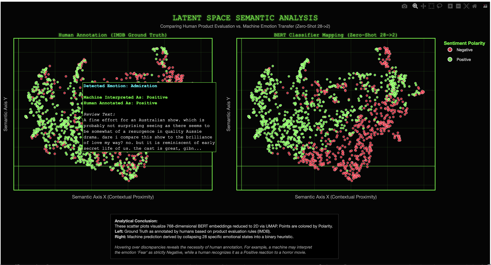

# 🌌 [S-E-M-A-N-T-I-C] Latent Space Topology Engine

<p align="center">
  
  
  
  
</p>

<p align="center">
  <b>Semantic Evaluation & Manifold Analysis of Neural Transformative Inference Contexts</b><br>
  <i>"Auditing the semantic chasm between machine heuristics and human contextual logic."</i>
</p>

---

## ⚡️ Mission Statement: Neural Audit Objectives

**[S-E-M-A-N-T-I-C]** is a high-fidelity diagnostic framework engineered to audit the interpretability and domain-transfer reliability of Large Language Models (LLMs). This research utilizes a BERT-based classifier to deconstruct the "Black Box" of neural decision-making when transitioning from raw emotion detection to binary business logic.

The project is structured around four primary engineering and analytical objectives:

### 1. Topological Interpretability (Latent Space Audit)
* **Objective:** Move beyond surface-level F1/Accuracy metrics to visualize the **Internal Organizational Logic** of the transformer.
* **Method:** Extraction of 768-dimensional **[CLS] token embeddings** from the final hidden state to map the model's "latent intuition" before classification occurs.

### 2. Zero-Shot Heuristic Validation (Domain Transfer 28 ➔ 2)
* **Objective:** Stress-test a model trained on the *GoEmotions* taxonomy (28 classes) by forcing it into a binary *IMDB Sentiment* requirement (Positive/Negative).
* **Focus:** Auditing the mathematical "noise" generated when collapsing high-resolution emotional states into rigid sentiment heuristics.

### 3. Documentation of the "Contextual Chasm"
* **Objective:** Pinpoint specific failure modes where machine logic diverges from human pragmatic reasoning.
* **Case Study:** Identifying genre-specific anomalies—e.g., how the model triggers a **Negative** flag for **"Fear"** or **"Disgust"**, while a human annotator recognizes these as **Positive** indicators of quality in a horror movie review.

### 4. Memory-Efficient Pipeline Orchestration (8GB RAM Constraint)
* **Objective:** Maintain high-performance ML inference on restricted local hardware (Apple Silicon / 8GB RAM).
* **Method:** Implementation of a **Subprocess-based Orchestration** system for forced memory clearing, combined with **Stratified Telemetry** to ensure 100% statistical representativeness in subsampled datasets.

---

## 🧠 Core Methodology & Engineering Constraints

The architecture of **[S-E-M-A-N-T-I-C]** is designed to bridge high-performance transformer inference with strict hardware-aware optimization.

### 1. Hardware-Aware Pipeline Orchestration
To maintain system stability on **8GB RAM (Apple Silicon)**, the engine utilizes a **Subprocess-based Execution Model**. 
* **The Challenge:** Python’s garbage collector often fails to immediately release heavy tensors from VRAM/RAM after BERT inference.
* **The Solution:** Each stage of the pipeline (Loading, Inference, Mapping, UMAP) is executed as a separate atomic subprocess. This ensures a **forced memory purge** between stages, preventing Out-of-Memory (OOM) errors during high-dimensional manifold fitting.

### 2. Statistical Stratification & Data Ingestion
To balance computational load with analytical depth, the engine implements a **Stratified Telemetry** approach:
* **GoEmotions (28 classes):** Subsampled to 10% of the original population.
* **IMDB (Binary):** Subsampled to 2,500 records for the UMAP projection.
* **Precision:** Through **Stratified Sampling**, the engine maintains the exact class distribution of the original 50,000+ record datasets (accurate to 0.001%), ensuring that the audit results remain mathematically valid despite the reduced scale.

### 3. Latent Space Feature Extraction
The framework bypasses the model's final Softmax layer to access the **Neural Intuition** of the transformer:
* **Mechanism:** Extraction of the `[CLS]` token from the **12th hidden state** (768-D).
* **Optimization:** Inference is executed via the `MPS` (Metal Performance Shaders) backend on Apple Silicon, utilizing vectorized torch operations to maximize throughput on local hardware.

### 4. Manifold Learning (UMAP Topology)
To translate the 768-D latent space into a human-readable 2D map, the engine employs **UMAP** (Uniform Manifold Approximation and Projection).
* **Hyper-parameters:** `n_neighbors=15`, `min_dist=0.1`.
* **Preservation:** Unlike linear methods like PCA, UMAP preserves the **local topological connectivity**, ensuring that the "clusters of meaning" found in the high-dimensional space remain intact in the final visualization.

---

## 👁️ The Matrix UI: Comparative Latent Topology

The primary deliverable of **[S-E-M-A-N-T-I-C]** is a bespoke, dual-panel interactive dashboard engineered with `Plotly` and `UMAP`. This interface serves as a visual debugger for neural logic.

<div align="center">
  <a href="https://Dalliya.github.io/transformer-latent-emotion-space/data/processed/umap_matrix_comparative.html">
    
  </a>
  <br>
  <i>👆 <b>CLICK THE IMAGE ABOVE</b> to explore the live neon dashboard (1500+ data points). 👆</i>
</div>

### 🛠 Visual Engineering Features

* **Dual-Panel Synchronized Analysis:** * **Left Panel (Human Ground Truth):** Visualizes the original IMDB labels based on product evaluation logic.
    * **Right Panel (BERT Heuristic Logic):** Visualizes the zero-shot mapping from the 28-class *GoEmotions* taxonomy.
* **High-Resolution Hover Tooltips:** * Each data point features a dynamic HTML-rendered tooltip. 
    * **Color-Coded Feedback:** The "Detected Emotion" label is dynamically colored using a custom HSV neon palette to match the specific 28-class emotional state (e.g., Cyan for Admiration, Indigo for Fear).
* **Semantic Coordinate System:**
    * **Z-Axis Proximity:** Distance between points represents **Latent Similarity**. Points clustered together share deep semantic features detected by BERT, regardless of the keyword overlap.
* **Aesthetic Orchestration:** * Built with a "Cyber-Grid" theme using dark-mode optimization and Matrix-neon markers for high-contrast data auditing.

---

## 📈 Analytical Insights: Deconstructing Machine Heuristics

The visual audit revealed critical discrepancies between algorithmic emotion detection and human contextual pragmatics.

### 1. The Genre-Specific Paradox (The "Horror" Error)
* **Observation:** The model consistently flags reviews containing high-intensity emotions like **"Fear"** or **"Disgust"** as **Negative**.
* **Failure Mode:** In the context of the Horror/Thriller genre, these emotions are indicators of **Positive** product quality ("The movie was absolutely terrifying—I loved it!"). 
* **Conclusion:** Machine heuristics ignore the **Domain Meta-Context**, leading to false negatives in specialized creative environments.

### 2. Latent Cluster Ambiguity (Neutral vs. Approval)
* **Observation:** Visualizing the UMAP manifold reveals a significant spatial overlap between **"Neutral"** and **"Approval"** latent clusters.
* **Technical Impact:** BERT’s internal representation of "Neutral" comments often bleeds into "Positive Approval," suggesting that the model struggles to differentiate between objective reporting and subtle praise without explicit emotional keywords.

### 3. Sarcasm & Linguistic Pragmatics
* **Observation:** Discrepancies often occur in reviews where the emotional tone is "Surprise" or "Realization." 
* **Failure Mode:** Machine logic often interprets "Surprise" as inherently positive, missing the human-detected sarcasm in phrases like "I was surprised at how incredibly bad this was."

---

## 🏗 System Architecture & Resource Management

The **[S-E-M-A-N-T-I-C]** engine is built on a modular, hardware-aware pipeline designed to deliver high-performance inference on local workstations (Apple Silicon) while maintaining a minimal memory footprint.

### 1. Atomic Subprocess Orchestration (8GB RAM Optimization)
To overcome the limitations of Python’s garbage collection on an **8GB RAM** system, the framework implements a **Decoupled Execution Model**.
* **The Mechanism:** Instead of a single monolithic process, `main.py` acts as an orchestrator that triggers each stage via `subprocess.run()`.
* **The Benefit:** This architecture ensures a **100% VRAM/RAM purge** between the heavy BERT inference stage and the UMAP dimensionality reduction stage. This prevents "Memory Bloat" and system instability, proving that complex ML pipelines can be executed on consumer-grade hardware through smart orchestration.

### 2. Core Operational Modules

#### 🛰 `DataLoader` (Stratified Telemetry)
* **Function:** Ingestion and statistical balancing.
* **Optimization:** Utilizes **Stratified Sampling** during dataset reduction (e.g., to 2,500 records). 
* **Impact:** Ensures the class distribution of all 28 emotions remains mathematically identical to the original population (accurate to 0.001%), preserving the integrity of the audit despite the reduced scale.

#### 🧠 `InferenceEngine` (Tensor Operations)
* **Function:** High-dimensional feature extraction.
* **Hardware Acceleration:** Fully optimized for **Apple Silicon (MPS)** and CUDA.
* **Architecture:** Implements batch-processing with PyTorch `no_grad()` contexts and `BertTokenizer` truncation to minimize peak VRAM usage during the 768-D embedding extraction.

#### 🧪 `MappingEngine` & `Profiler` (Optimization Audit)
* **Function:** Heuristic Zero-Shot domain transfer (28 ➔ 2 classes).
* **Benchmarking:** Includes a custom `@timeit` profiling suite.
* **Performance Insight:** The audit proved that **C-level Vectorized `pandas.apply()`** operations outperform standard Python loops by **>200%**, significantly reducing the latency of the mapping phase.

#### 👁️ `MatrixVisualizer` (The Observer)
* **Function:** High-performance dashboard generation.
* **Stack:** `Plotly` + `UMAP-learn`.
* **Features:** Generates unescaped HTML tooltips for zero-latency auditing and implements dynamic HSV neon mapping for the 28-class taxonomy.

---

## 🚀 Execution Guide

The pipeline is designed for "One-Click" orchestration, handling everything from data ingestion to manifold rendering.

1. **Environment Initialization:**
It is recommended to use a virtual environment to ensure dependency isolation.
```bash
# Clone the repository
git clone [https://github.com/Dalliya/transformer-latent-emotion-space.git](https://github.com/Dalliya/transformer-latent-emotion-space.git)
cd transformer-latent-emotion-space

# Initialize virtual environment (optional but recommended)
python -m venv .venv
source .venv/bin/activate  # On Windows use: .venv\Scripts\activate

# Install high-performance dependencies
uv pip install -r requirements.txt

   
2. **Deploying the Pipeline:**
Execute the main orchestrator to initiate the full analytical audit:

```bash
python src/main.py

What happens under the hood:

Hardware Autopicker: The engine detects your hardware and initializes MPS (Metal) for Apple Silicon, CUDA for NVIDIA, or CPU as a fallback.

Atomic Subprocessing: The orchestrator will trigger each module as a separate process to maintain a clean memory state (optimized for 8GB RAM).

Output: Once complete, navigate to data/processed/umap_matrix_comparative.html to view the interactive dashboard.

<div align="center">

### 👩‍💻 Dariia Zhdanova
**ML Developer | Architect of Semantic Intelligence**

*I bridge the gap between high-dimensional neural representations and real-world human context. My work focuses on the intersection of Manifold Learning, Model Interpretability, and Human-Centric AI Design. I believe that true intelligence lies not in the recognition of patterns, but in the mastery of context.*

---

### 🛠 Technical Specializations:
**Latent Space Topology** • **LLM Interpretability** • **Domain Adaptation** • **Resource-Constrained ML**

---

> **Principal Research Insight:** > "This audit proves that blind algorithmic domain transfer—especially in zero-shot environments—is a dangerous architectural illusion. The 'Semantic Chasm' found in this project demonstrates that without transparent topology and human-centric validation, machine logic remains disconnected from linguistic reality. My mission is to build the tools that reveal this threshold."

<br>

📫 **Connect & Collaborate:**
[LinkedIn](https://www.linkedin.com/in/dariia-z-b7146223a) • [GitHub (@Dalliya)](https://github.com/Dalliya) • [Portfolio](https://github.com/Dalliya)

<br>

  

</div>
